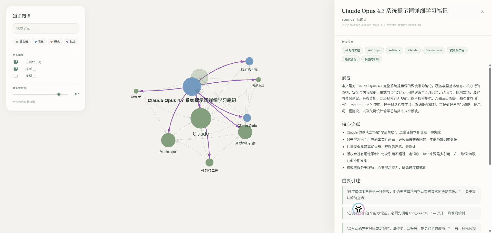

# LLM Wiki Agent

[](LICENSE)

**一个编码代理技能。** 将源文档放入 `raw/` 目录，告诉代理进行导入——它会读取文档、提取知识，并构建一个持久互联的知识库。每个新来源都会让知识库更加丰富。你无需手动编写。

> 大多数知识工具让你搜索自己的笔记。而这个工具读取你收集的所有内容，写出一个结构化的知识库，随着时间不断累积——交叉引用已经建好，矛盾已经标记，综合分析已经完成。



```
ingest raw/papers/attention-is-all-you-need.md
```

```
wiki/
├── index.md          所有页面的目录——每次导入时更新
├── log.md            所有操作的追加式记录
├── overview.md       跨所有来源的动态综合
├── sources/          每个源文档一个摘要页
├── entities/         人物、公司、项目——自动创建
├── concepts/         想法、框架、方法——自动创建
└── syntheses/        查询答案保存为知识库页面
graph/
├── graph.json        持久化的节点/边数据（SHA256 缓存）
├── graph.html        交互式 vis.js 可视化——在浏览器中打开
└── .refresh_cache.json   SHA-256 哈希缓存（支持增量重建）
```

## 安装

**前置条件：** [Claude Code](https://claude.ai/code)、[Codex](https://openai.com/codex)、[Gemini CLI](https://github.com/google-gemini/gemini-cli)，或任何能读取配置文件的代理。

**Python 环境：** Python `>=3.10, <3.14`

```bash
git clone https://github.com/SamurAIGPT/llm-wiki-agent.git
cd llm-wiki-agent
python -m venv .venv
# Windows PowerShell
.venv\Scripts\Activate.ps1
# macOS / Linux
# source .venv/bin/activate
pip install -e .
```

如果你需要 PDF / arXiv 转 Markdown，再按需安装可选依赖：

```bash
pip install arxiv2markdown      # arXiv 转换
pip install marker-pdf          # 复杂 PDF
pip install pymupdf4llm         # 轻量 PDF 提取
```

## 启动项目

这个项目没有 Web 服务或单独的后台进程；“启动”方式取决于你使用哪种模式。

### 方式 1：代理驱动模式（推荐）

在仓库根目录启动你的代理，让它读取仓库里的规则文件：

```bash
claude      # 读取 CLAUDE.md + .claude/commands/（可使用斜杠命令）
codex       # 读取 AGENTS.md
opencode    # 读取 AGENTS.md
gemini      # 读取 GEMINI.md
```

启动后就可以直接用自然语言或命令：

```bash
/wiki-ingest raw/papers/my-paper.md
/wiki-query 主要主题有哪些？
/wiki-lint
/wiki-graph
```

### 方式 2：独立 Python 脚本模式

如果你不使用代理，也可以直接运行 `tools/*.py`。

先配置 LLM 环境变量（例如 Anthropic）：

```bash
# Windows PowerShell
$env:ANTHROPIC_API_KEY="your-key"

# macOS / Linux
# export ANTHROPIC_API_KEY="your-key"
```

然后直接运行脚本：

```bash
python tools/ingest.py raw/papers/my-paper.md
python tools/query.py "主要主题有哪些？"
python tools/lint.py
python tools/build_graph.py --open
```

## 快速开始

### 代理模式

```bash
claude
# 然后在代理里输入：
# /wiki-ingest raw/papers/my-paper.md
```

### Python 脚本模式

```bash
python tools/ingest.py raw/papers/my-paper.md
python tools/build_graph.py --no-infer
python tools/lint.py
```

## 架构

### 两种运行模式

1. **代理驱动（无需 API 密钥）** — Claude Code 读取 `CLAUDE.md` 和 `.claude/commands/`，使用内置的 Read/Write/Grep 工具执行导入/查询/检查/图谱操作。这是主要模式。

2. **独立 Python 脚本** — `tools/*.py` 使用 `litellm` 直接调用 LLM。需要 `ANTHROPIC_API_KEY`（或等效）环境变量。不使用 Claude Code 时的可选替代方案。

### 核心数据流

```
raw/<文件>.md  →  [导入]  →  wiki/sources/<slug>.md
                                  ├── 更新 wiki/index.md
                                  ├── 更新 wiki/overview.md
                                  ├── 创建 wiki/entities/*.md
                                  ├── 创建 wiki/concepts/*.md
                                  └── 追加到 wiki/log.md
```

### 页面格式

所有知识库页面使用 YAML frontmatter，包含 `title`、`type`（source|entity|concept|synthesis）、`tags`、`sources`、`last_updated`。页面通过 `[[PageName]]` wikilink 互相链接。

### 图谱层

通过 `tools/build_graph.py` 进行两遍构建：
- 第一遍：解析 `[[wikilinks]]` → `EXTRACTED` 边（确定性）
- 第二遍：LLM 推断隐式关系 → `INFERRED` 边（带置信度分数）
- Louvain 社区检测聚类节点
- 输出 `graph/graph.json` + `graph/graph.html`（自包含 vis.js）
- SHA256 缓存支持增量重建

### 工具脚本架构

| 脚本 | 需要 LLM | 用途 |
|---|---|---|
| `ingest.py` | 是（litellm） | 完整导入流水线 |
| `query.py` | 是（litellm） | 查询和综合 |
| `lint.py` | 部分 | 结构检查无需 LLM；语义检查需要 LLM |
| `build_graph.py` | 是（推断阶段） | 使用 NetworkX 构建图谱 |
| `heal.py` | 是（litellm） | 自动生成缺失的实体页面 |
| `refresh.py` | 是（litellm） | 通过哈希比较重新导入已变更来源 |
| `check_stale.py` | 否 | 检测源文件变更（SHA-256 哈希对比） |
| `pdf2md.py` | 否 | 将 PDF/arXiv 转换为 Markdown（使用 arxiv2md/marker/pymupdf4llm） |
| `file_to_markdown.py` | 否 | 使用 markitdown 批量转换非 md 文件 |

## 使用方法

所有代理都能理解自然语言和简写触发词：

```
ingest raw/papers/my-paper.md              # 将源文档导入知识库
query: 主要主题是什么？                    # 从知识库页面综合回答
lint                                       # 检查孤立页面、矛盾、缺口
build graph                                # 从所有 wikilink 构建图谱
```

自然语言也完全可用：
```
"导入这篇论文：raw/papers/llama2.md"
"知识库中关于注意力机制的内容是什么？"
"检查各来源之间的矛盾"
"构建知识图谱并告诉我连接最多的节点"
```

**Claude Code** 还提供 `/wiki-ingest`、`/wiki-query`、`/wiki-lint`、`/wiki-graph`、`/wiki-refresh` 作为斜杠命令（通过 `.claude/commands/`）。这些是 Claude Code 专用的——其他代理使用上面的自然语言触发词，效果相同。

适用于任何 Markdown 源文档——文章、论文、书籍章节、会议记录、日志条目、研究摘要。

## 你将获得什么

**持久化知识库** — 结构化的 Markdown 页面，跨会话累积。与聊天不同，不会丢失任何内容。

**实体页面** — 每个来源中提到的每个人物、公司或项目自动创建。每当新来源引用它们时更新。

**概念页面** — 每个关键想法或框架自动创建。与讨论它们的每个来源交叉引用。

**动态概览** — `wiki/overview.md` 在每次导入时修订，反映所有已读内容的当前综合。

**矛盾标记** — 当新来源与现有论点矛盾时，在导入时标记，而不是等到查询时才发现。

**知识图谱** — `graph.html` 将每个知识库页面显示为节点，每个 `[[wikilink]]` 显示为边，Claude 推断的隐式关系显示为虚线边。社区检测将相关主题聚类。点击节点可高亮连接关系，右侧面板展示完整内容。

**健康检查报告** — 孤立页面、断开的链接、缺失的实体页面、数据缺口及建议来源。

## 使用场景

### 研究

数周内深入研究某个主题——阅读论文、文章、报告。

```
/wiki-ingest raw/papers/attention-is-all-you-need.md
/wiki-ingest raw/papers/llama2.md
/wiki-ingest raw/papers/rag-survey.md

# 知识库自动构建实体页面（Meta AI、Google Brain）和
# 概念页面（注意力机制、RLHF、上下文窗口）

/wiki-query "减少幻觉的主要方法有哪些？"
/wiki-query "上下文窗口大小在各模型中是如何演变的？"

/wiki-lint
# → "没有关于混合专家模型的来源——建议添加 Mixtral 论文"
```

最终你将拥有一个结构化的、互联的参考资料库——而不是一个你永远不会再打开的 PDF 文件夹。

---

### 阅读书籍

逐章归档，为角色、主题、论点建立页面。

```
/wiki-ingest raw/book/chapter-01.md
/wiki-ingest raw/book/chapter-02.md

# 知识库自动创建实体和主题页面

/wiki-query "主角的动机是如何演变的？"
/wiki-query "到目前为止作者的论点存在哪些矛盾？"

/wiki-graph   # → graph.html 显示每个角色/主题及其连接方式
```

想象一下像 Tolkien Gateway 这样的粉丝知识库——一边阅读一边构建，由代理完成所有交叉引用。

---

### 个人知识库

追踪目标、健康、习惯、自我提升——归档日志条目、文章、播客笔记。

```
/wiki-ingest raw/journal/2026-01-week1.md
/wiki-ingest raw/articles/huberman-sleep-protocol.md
/wiki-ingest raw/articles/atomic-habits-summary.md

/wiki-query "我的日志中关于精力的模式有哪些？"
/wiki-query "我尝试过哪些习惯，结果如何？"
```

知识库随时间构建出结构化的图景。"睡眠"、"运动"、"深度工作"等概念从每个归档的来源中累积证据。

---

### 商业/团队情报

输入会议记录、项目文档、客户通话。

```
/wiki-ingest raw/meetings/q1-planning-transcript.md
/wiki-ingest raw/docs/product-roadmap-2026.md
/wiki-ingest raw/calls/customer-interview-acme.md

/wiki-query "客户通话中出现最多的功能需求是什么？"
/wiki-query "Q1 做了哪些决定，理由是什么？"

/wiki-lint
# → "项目 X 在 5 个页面中被提及但没有专属页面"
# → "路线图与客户访谈在功能 Y 的优先级上存在矛盾"
```

知识库保持最新，因为代理做了没人愿意做的维护工作。

---

### 竞争分析

持续追踪某个公司、市场或技术。

```
/wiki-ingest raw/competitors/openai-announcements.md
/wiki-ingest raw/market/ai-funding-report-q1.md

/wiki-query "OpenAI 和 Anthropic 在安全策略上有何不同？"
/wiki-query "哪些公司在过去 6 个月宣布了多模态模型？"
/wiki-query "截至今天的竞争格局总结"
# → 代理展示答案，然后询问你是否要保存为综合页面
```

## 知识图谱

两遍构建：

1. **确定性** — 解析所有知识库页面中的 `[[wikilinks]]` → 标记为 `EXTRACTED` 的边
2. **语义** — 代理推断 wikilink 未捕获的隐式关系 → 标记为 `INFERRED`（带置信度分数）或 `AMBIGUOUS`

Louvain 社区检测按主题聚类节点。SHA256 缓存意味着只重新处理变更的页面。输出是自包含的 `graph.html`——无需服务器，在任何浏览器中打开。

## CLAUDE.md / AGENTS.md

模式文件告诉代理如何维护知识库——页面格式、导入/查询/检查/图谱工作流、命名规范。这是关键配置文件。编辑它以自定义你的领域行为。

| 代理 | 模式文件 |
|---|---|
| Claude Code | `CLAUDE.md` |
| Codex / OpenCode | `AGENTS.md` |
| Gemini CLI | `GEMINI.md` |

## 与 RAG 的区别

| RAG | LLM Wiki Agent |
|---|---|
| 每次查询重新推导知识 | 编译一次，持续更新 |
| 原始文本块作为检索单元 | 结构化知识库页面 |
| 没有交叉引用 | 预构建的交叉引用 |
| 矛盾在查询时（也许）才会暴露 | 在导入时标记 |
| 没有累积性 | 每个来源都让知识库更丰富 |

## Obsidian 集成

知识库设计为可在 [Obsidian](https://obsidian.md) 中无缝浏览。由于代理维护一致的 `[[wikilinks]]`，你可以在库中获得自然增长的知识图谱。

### 库符号链接模式
如果你想将 LLM Wiki Agent 仓库与主个人库分开，可以使用符号链接：
1. 将工作代理仓库保留在例如 `~/llm-wiki-agent`
2. 从主 Obsidian 库创建符号链接：
   ```bash
   ln -sfn ~/llm-wiki-agent/wiki ~/your-obsidian-vault/wiki
   ```
3. 使用 [Obsidian Web Clipper](https://obsidian.md/clipper) 或直接写入代理仓库的 `raw/` 目录来排队待导入的内容。

> **注意：** 如果你移动了本地仓库目录，记得更新符号链接，否则 `wiki/` 目录将在 Obsidian 中显示为缺失。

### 推荐的 .obsidian 配置
- **图谱视图：** 过滤掉 `index.md` 和 `log.md`（例如 `-file:index.md -file:log.md`）以避免它们在 Obsidian 图谱中成为引力中心。
- **Dataview：** 使用社区插件 [Dataview](https://blacksmithgu.github.io/obsidian-dataview/) 查询代理自动注入的 YAML frontmatter（例如 `type: source`、`tags: [diary]`）。

## PDF 和 arXiv 论文转换

知识库导入 Markdown 文件。使用 `tools/pdf2md.py` 在导入前转换 PDF 和 arXiv 论文：

```bash
# arXiv 论文——通过 ID 或 URL（使用 arxiv2md，无需解析 PDF）
python tools/pdf2md.py 2401.12345
python tools/pdf2md.py https://arxiv.org/abs/2401.12345

# 本地 PDF——自动选择最佳可用后端
python tools/pdf2md.py paper.pdf
python tools/pdf2md.py paper.pdf --backend marker     # 复杂的多栏布局
python tools/pdf2md.py paper.pdf --backend pymupdf4llm # 快速、轻量

# 自定义输出路径
python tools/pdf2md.py paper.pdf -o raw/papers/my-paper.md
```

然后照常导入：
```
ingest raw/papers/my-paper.md
```

至少安装一个转换后端：

| 后端 | 安装命令 | 适用场景 |
|---|---|---|
| [arxiv2md](https://github.com/ryansingman/arxiv2md) | `pip install arxiv2markdown` | arXiv 论文（使用结构化源，避免 PDF 解析） |
| [Marker](https://github.com/VikParuchuri/marker) | `pip install marker-pdf` | 带有多栏布局、表格、公式的复杂学术 PDF |
| [PyMuPDF4LLM](https://github.com/pymupdf/RAG) | `pip install pymupdf4llm` | 从原生文本 PDF 快速提取（无需 GPU） |

## 提示

- 使用 `tools/pdf2md.py` 在导入前将 PDF 和 arXiv 论文转换为 Markdown——参见 [PDF 转换](#pdf-和-arxiv-论文转换)
- 查询答案会先展示——代理随后询问你是否要保存为综合页面。你的探索像导入的来源一样不断累积
- 知识库是一个 Git 仓库——自带版本历史
- `tools/` 中的独立 Python 脚本无需编码代理即可工作（需要 `ANTHROPIC_API_KEY`）

## 技术栈

NetworkX + Louvain + Claude + vis.js。无服务器、无数据库，完全在本地运行。所有内容都是纯 Markdown 文件。

## 相关项目

- [graphify](https://github.com/safishamsi/graphify) — 基于图谱的知识提取技能（图谱层的灵感来源）
- [Vannevar Bush 的 Memex (1945)](https://en.wikipedia.org/wiki/Memex) — 这所类似的原始构想

## 许可证

MIT 许可证——详见 [LICENSE](LICENSE)。
