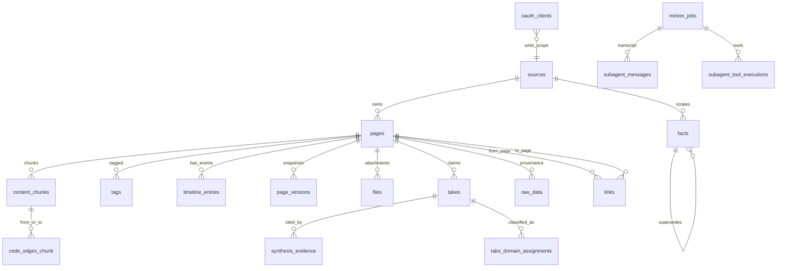

# GBrain 知识库设计剖析

> 本文档基于对 GBrain 项目源码的剖析，整理其知识库底层设计。GBrain 的"知识库"不是单纯一堆 Markdown，而是 **Markdown/文件系统 + Postgres/PGLite 关系库 + pgvector 检索索引 + 图关系 + 结构化事实层** 的组合。
>
> 配套阅读：[WeKnora RAG 架构剖析](../WeKnora/docs/rag-architecture.md)（待补）、[WeKnora Wiki 架构](../WeKnora/docs/wiki-architecture.md)、[WeKnora KB 架构](../WeKnora/docs/kb-architecture.md)。本文与 WeKnora 设计的差异点见 [第 6 节](#6-与-weknora-设计的对比)。

---

## 目录

- [1. 一句话心智模型](#1-一句话心智模型)
- [2. 实体关系图](#2-实体关系图)
- [3. 核心实体详解](#3-核心实体详解)
- [4. 表分类速查](#4-表分类速查)
- [5. 关键设计细节](#5-关键设计细节)
- [6. 与 WeKnora 设计的对比](#6-与-weknora-设计的对比)
- [7. 设计借鉴建议](#7-设计借鉴建议)
- [8. 待深挖分支](#8-待深挖分支)

---

## 1. 一句话心智模型

> **GBrain 把知识设计成：`source` 里的 `page` 是原子知识页；`chunk` 负责召回；`link` 负责图关系；`fact/take` 负责结构化、可追踪、可随时间演化的记忆；MCP/OAuth/minion/eval 表围绕这个核心提供远程访问、后台处理和质量验证。**

核心抽象层级：

```
source (内容仓库)
   │
   └─ page (原子知识页，按 slug 组织)
        │
        ├─ chunk (检索召回单元，pgvector 索引)
        │
        ├─ link (图边，typed edge，连接到其他 page)
        │
        ├─ fact (热记忆/事件/偏好)
        │
        └─ take (带权重、holder、可验证性的判断/主张)
```

外层环绕：MCP（远程访问）/ OAuth（授权）/ minion（后台任务）/ eval（质量评测）。

---

## 2. 实体关系图



---

## 3. 核心实体详解

### 3.1 source（内容仓库）

- **定位**：一个 brain（数据库实例）里可以有多个 source。
- **作用**：内容隔离边界。所有 page 都带 `source_id`，读路径通过 `sourceScopeOpts` 做隔离（见 [operations.ts:417](./gbrain/src/core/operations.ts#L417)）。
- **类比 WeKnora**：相当于 WeKnora 的 `KnowledgeBase` —— 都是配置 + 隔离边界。

### 3.2 page（原子知识页）

- **定位**：知识的最小可读单元，按 `(source_id, slug)` 唯一组织。
- **承载**：markdown 内容 + frontmatter + 元信息（标题、tags、timeline 事件、附件、版本快照）。
- **类比 WeKnora**：相当于 WeKnora 的 `Knowledge`（一次导入的资料源）+ `wiki_page`（结构化可读页）的合体。GBrain 不区分"原始文件"和"派生页"，page 既是源也是产物。

### 3.3 chunk（检索召回单元）

- **定位**：page 切块后的最小检索单元。
- **承载**：`content_chunks` 表，包含切块文本 + 三套 embedding（`embedding` / `embedding_image` / `embedding_multimodal`）+ 代码符号元数据。
- **多模态 embedding**：GBrain 在 chunk 层做了三套向量，对应不同的检索模式。
- **类比 WeKnora**：相当于 WeKnora 的 `Chunk`，但 GBrain 把多模态向量直接挂在 chunk 上，而 WeKnora 是用 `chunk_type=image_ocr/image_caption` 区分。

### 3.4 link（图边）

- **定位**：page 到 page 的有向边，构成知识图谱。
- **承载**：`links` 表，强 FK 连接 `from_page_id` / `to_page_id`，支持 typed edge（边的类型）和 provenance（frontmatter 自动提取 / markdown 链接 / 手工标注）。
- **类比 WeKnora**：相当于 WeKnora 的 `wiki_pages.in_links/out_links`（双向链接），但 GBrain 是关系表（关系数据库），WeKnora 是 JSONB 列。

### 3.5 fact / take（结构化记忆）

这是 GBrain 区别于 WeKnora 的**最大差异点**——把"事实"和"主张"建模为一等公民。

#### fact（热记忆）

- **定位**：事件 / 偏好 / 短期记忆。
- **作用域**：source 级（每条 fact 带 `source_id`）。
- **演化**：通过 `facts.supersedes` 形成版本链，新 fact 覆盖旧 fact 但不删除。

#### take（带权判断）

- **定位**：带权重、holder、可验证性的判断或主张。
- **承载**：`takes` 表 + `synthesis_evidence`（证据）+ `take_domain_assignments`（领域分类）+ `calibration_profiles`（校准）+ `take_proposals`（提案）+ `take_grade_cache`（评分缓存）+ `take_nudge_log`（推动记录）+ `think_ab_results`（A/B 实验）。
- **理念**：take 不是事实，是"某个 holder 在某时某地对某事的判断"，可以被后续 take 推翻。

#### 与 WeKnora 的根本差异

WeKnora 的设计哲学是**"事实 = 已索引的源文本"**，所有派生层（summary / wiki / graph）都是源文本的可重建投影。GBrain 则引入了**"主观判断"**这一层，让知识库不只是检索工具，还是一个"会演化、会被推翻"的认知系统。

---

## 4. 表分类速查

GBrain 的表数量远超 WeKnora（数十张），按职责分 5 类：

### 4.1 知识本体（13 张）

```
sources, pages, content_chunks, links, tags, raw_data,
timeline_entries, page_versions, ingest_log, files,
file_migration_ledger, slug_aliases, page_aliases
```

### 4.2 结构化记忆（9 张）

```
facts, takes, synthesis_evidence, take_domain_assignments,
calibration_profiles, take_proposals, take_grade_cache,
take_nudge_log, think_ab_results
```

### 4.3 检索 / 代码索引 / 评测（11 张）

```
query_cache, search_telemetry,
code_edges_chunk, code_edges_symbol, code_traversal_cache,
eval_candidates, eval_capture_failures, eval_takes_quality_runs,
eval_contradictions_cache, eval_contradictions_runs,
extract_rollup_7d, conversation_parser_llm_cache
```

### 4.4 权限 / 远程 MCP / 预算（10 张）

```
config, access_tokens,
mcp_request_log,
oauth_clients, oauth_tokens, oauth_codes,
mcp_spend_log, mcp_spend_reservations,
budget_ledger, budget_reservations
```

### 4.5 后台任务 / Agent Runtime（17 张）

```
minion_jobs, minion_inbox, minion_attachments,
subagent_messages, subagent_tool_executions, subagent_rate_leases,
gbrain_cycle_locks, dream_verdicts, migration_impact_log,
op_checkpoints, op_checkpoint_paths, context_volunteer_events,
minion_lease_pressure_log, minion_budget_log, minion_self_fix_log,
drift_decisions
```

**表定义主来源**：
- [schema.sql](./gbrain/src/schema.sql#L26)
- [pglite-schema.ts](./gbrain/src/core/pglite-schema.ts#L36)
- [migrate.ts](./gbrain/src/core/migrate.ts#L1191)

---

## 5. 关键设计细节

### 5.1 Brain = 一个数据库

PGLite 本地嵌入式（开发/Lite），或 Postgres/Supabase + pgvector（生产）。多 brain 之间是物理隔离（不同数据库实例），不是逻辑 schema 隔离。

### 5.2 fact.entity_slug 不是强 FK

`facts.entity_slug` 逻辑上指向 `pages.slug`，但**不**用外键约束。原因：
- 多源场景下 entity 可能在不同 source 里
- 历史 slug 重命名时要保持 fact 仍然指向逻辑实体
- 软引用换来灵活性，代价是引用一致性靠应用层维护

### 5.3 links 是知识图谱的核心

`links` 通过 `from_page_id` / `to_page_id` 强 FK 连接 `pages`，加上 `link_type` 形成 typed graph。三种 provenance：
1. **frontmatter**：用户在 frontmatter 里显式声明
2. **markdown**：从正文 `[[...]]` 链接自动提取
3. **manual**：后台 minion job 主动建的边

### 5.4 chunk 多模态向量三套并存

`content_chunks` 表同时挂三列向量：
- `embedding`：纯文本 embedding
- `embedding_image`：图片向量
- `embedding_multimodal`：图文混合向量

查询时按 search mode 选不同列，避免不同模态的向量被错误混合。

### 5.5 query_cache 用复合 hash 防污染

`query_cache` 用 `source_id + knobs_hash + generation` 作为 key：
- `source_id`：隔离不同 source
- `knobs_hash`：不同的 search mode / schema pack / embedding 配置算不同 hash
- `generation`：schema 升级时整体失效

这避免了"换了一种检索配置但缓存命中旧结果"的污染问题。

### 5.6 主入口 put_page 的副作用链

[operations.ts:724](./gbrain/src/core/operations.ts#L724) 的 `put_page` 是知识写入的主入口。一次调用会触发：

```
put_page(page)
   │
   ├─ 解析 markdown（frontmatter + body）
   ├─ 写 page 主表
   ├─ 切 chunks
   ├─ 计算并写入 embeddings（三套）
   ├─ 同步 tags
   ├─ 自动提取 links（typed edge）
   ├─ 自动提取 timeline_entries
   └─ 触发 facts backstop（LLM 抽取关键事实）
```

底层统一抽象是 [BrainEngine](./gbrain/src/core/engine.ts#L646)。

---

## 6. 与 WeKnora 设计的对比

| 维度 | GBrain | WeKnora |
|---|---|---|
| **存储后端** | Postgres/PGLite + pgvector（合一） | Postgres（真相）+ 外部向量库（OpenSearch 等） |
| **多租户模型** | 一个 brain = 一个数据库（物理隔离） | 一个 Postgres 集群 + tenant_id 列（逻辑隔离） |
| **核心写入单元** | page（既是源也是产物） | knowledge（源）+ chunk（检索单元）+ wiki_page（派生页）三层分离 |
| **图关系存储** | `links` 关系表（强 FK） | WeKnora wiki 用 `wiki_pages.in_links/out_links` JSONB 列；图谱实体/关系混在 `chunks` 表里用 `chunk_type=entity/relationship` 区分 |
| **多模态向量** | chunk 上挂 3 列（text/image/multimodal） | 用 chunk_type 区分（text/image_ocr/image_caption），每个 chunk 单独一行 |
| **结构化记忆** | 一等公民（fact + take + 9 张相关表） | 无独立"事实层"——所有派生都是源文本投影（summary/wiki/graph） |
| **派生层重建** | fact/take 不一定能从 page 重建（含主观判断） | wiki/graph/summary 都可从 chunks + 模型完全重建 |
| **配置层级** | source（内容仓库） | KnowledgeBase（4 个独立 IndexingStrategy 开关） |
| **后台 agent runtime** | 17 张表（minion/subagent/drift） | 异步任务队列 asynq + Redis，无独立 agent runtime 表 |
| **MCP 集成** | 一等公民（mcp_request_log / mcp_spend_log 等 10 张表） | 通过 plugin 机制集成，无独立预算/审计表 |
| **OAuth 授权** | 一等公民（oauth_clients/tokens/codes） | RBAC（TenantRole + OrgMemberRole），无 OAuth 服务端 |

### 6.1 哲学差异

**WeKnora**：知识库 = 检索系统。"事实"是已索引的源文本，所有派生层（summary/wiki/graph）都是源文本的可重建投影。**核心问题是"如何高效找到相关内容"。**

**GBrain**：知识库 = 认知系统。除了源文本检索，还有"主观判断"（take）和"演化记忆"（fact + supersedes 链）。**核心问题是"如何让知识库随对话演化，并保留判断的可追溯性"。**

两种设计没有绝对优劣，对应不同的产品定位：
- WeKnora 适合**企业知识管理 / 文档问答 / 客服**——用户问的是"文档里写了什么"
- GBrain 适合**长期记忆 agent / 个性化助手 / 研究 assistant**——用户问的是"基于历史判断，这件事怎么看"

### 6.2 数据库选型差异

- **GBrain** 选 Postgres + pgvector 合一：开发简单（一套数据库）、PGLite 嵌入式可本地跑、但向量大体量下性能上限低于专业向量库
- **WeKnora** 选 Postgres + 外部向量库分离：生产可换 OpenSearch/Milvus 等专业引擎、向量库可独立扩容、但部署复杂度高

### 6.3 图存储差异

- **GBrain**：用 `links` 关系表（强 FK），不依赖外部图数据库，简单但图查询能力有限（递归查询靠 CTE）
- **WeKnora**：图谱实体/关系**混在 chunks 表**（chunk_type 区分），可选 Neo4j 作为图查询引擎

---

## 7. 设计借鉴建议

如果你在做自研知识库项目，可以参考 GBrain 的几个设计：

### 7.1 必借点

1. **source 多内容仓库设计** —— 一个 brain 多个 source，每条数据带 `source_id`，读路径用 `sourceScopeOpts` 隔离。比单仓库灵活，比多租户轻量。
2. **page 既源既产物** —— 不像 WeKnora 分三层（knowledge + chunk + wiki_page），GBrain 的 page 同时承担"原始资料"和"可读知识页"两个角色，简化了心智模型。
3. **links 关系表** —— 比 JSONB 列（WeKnora）更适合频繁的图查询和强一致性约束。
4. **query_cache 复合 hash 防污染** —— `source_id + knobs_hash + generation` 的设计很值得抄。

### 7.2 视场景而定的点

1. **fact/take 结构化记忆层** —— 如果你的产品定位是"长期记忆 agent"或"个性化助手"，必借；如果是"文档问答"，可不引入（会增加复杂度）。
2. **多模态向量三列并存** —— 如果你的产品需要图文混合检索，比 WeKnora 的"分 chunk_type"更直接；但代价是每行 chunk 多了 2 列向量，存储成本翻倍。
3. **minion/subagent 后台 runtime** —— 如果你的产品有"AI 后台整理知识"的需求，值得参考 GBrain 的 17 张表设计；如果是被动响应式 RAG，不需要。

### 7.3 不建议借的点

1. **PGLite 嵌入式** —— 适合个人/桌面端，不适合多用户 Web 服务。
2. **fact.entity_slug 不用强 FK** —— 是为多源/历史兼容的妥协，自研项目如果没这些约束，应该用强 FK 保证引用一致性。

### 7.4 与 WeKnora 设计结合的可能性

最理想的"自研知识库"可能结合两者优势：
- **WeKnora 的多引擎向量库抽象**（生产可换 OpenSearch/Milvus）
- **GBrain 的 source 多仓库设计**（轻量多租户）
- **GBrain 的 page 既源既产物**（简化心智模型）
- **GBrain 的 links 关系表**（图查询友好）
- **GBrain 的 take 结构化记忆**（如果定位是长期记忆 agent）
- **WeKnora 的 IndexingStrategy 4 开关**（能力可组合）

---

## 8. 待深挖分支

下一轮可以专门拷问其中一个分支：

### 8.1 facts/takes 结构化记忆层

要回答的问题：
- fact 的写入触发条件是什么？（`put_page` 时的 LLM backstop）
- take 的 holder / verifiability / weight 怎么定义、怎么演化？
- `synthesis_evidence` 怎么把 take 和源 page 关联起来？
- `calibration_profiles` 怎么对 take 做校准？
- `take_proposals` → `takes` 的提案流程是什么样的？
- `think_ab_results` 怎么做 A/B 实验？
- fact 与 take 的边界在哪里？

### 8.2 pages/chunks/links 检索与图谱层

要回答的问题：
- `content_chunks` 的切块策略是什么？
- 三套 embedding 在检索时怎么混合使用？
- `code_edges_chunk` / `code_edges_symbol` 怎么做代码索引？
- `links` 的 typed edge 有哪些类型？
- 图查询（递归、最短路径）怎么实现？是 SQL CTE 还是其他？
- `page_versions` 的快照机制（什么时候触发、怎么回放）？

---

## 附录：关键文件索引

| 文件 | 作用 |
|---|---|
| [operations.ts:724](./gbrain/src/core/operations.ts#L724) | `put_page` 主入口，写入副作用链 |
| [operations.ts:417](./gbrain/src/core/operations.ts#L417) | `sourceScopeOpts` 读隔离关键路径 |
| [engine.ts:646](./gbrain/src/core/engine.ts#L646) | `BrainEngine` 底层统一抽象 |
| [schema.sql:26](./gbrain/src/schema.sql#L26) | 表定义主来源 |
| [pglite-schema.ts:36](./gbrain/src/core/pglite-schema.ts#L36) | PGLite 表定义 |
| [migrate.ts:1191](./gbrain/src/core/migrate.ts#L1191) | 迁移脚本 |

---

*本文档基于对 GBrain 项目源码的剖析整理。与 WeKnora 设计的对比见第 6 节。*
