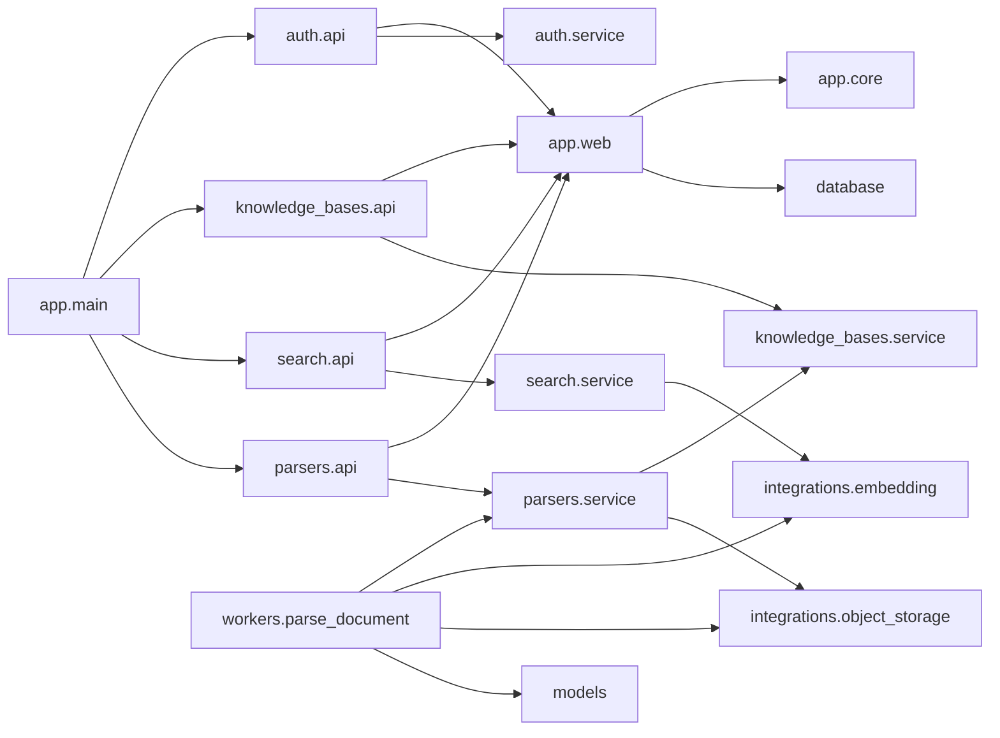
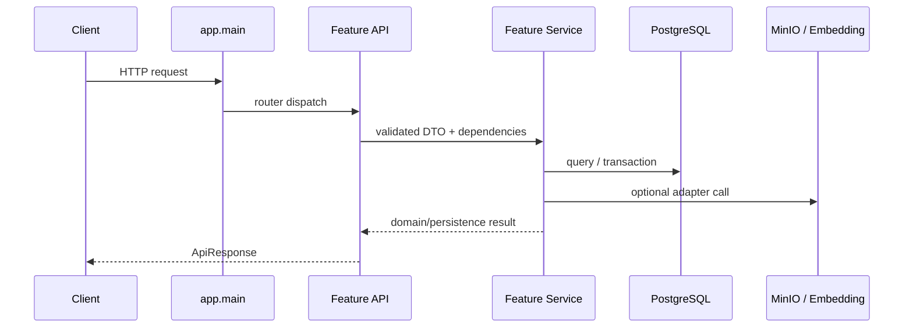
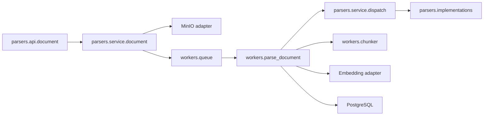

# CodeMap: backend 项目总图

## 1. 范围

- **project**: `backend`
- **root**: `backend/`
- **type**: Python / FastAPI 模块化单体
- **purpose**: 为后端目录结构重构提供当前架构、依赖方向和风险索引

## 2. 重构后目录视图

```text
backend/
├── alembic/                 # 数据库迁移
├── app/
│   ├── auth/                # api/service/security
│   ├── config/              # settings + logging
│   ├── core/                # 框架无关应用异常
│   ├── web/                 # 共享 HTTP schema/handler/DB dependency
│   ├── knowledge_bases/     # api/service
│   ├── search/              # api/service
│   ├── integrations/        # Embedding/MinIO 外部适配
│   ├── models/              # SQLAlchemy 持久化模型
│   ├── parsers/             # 已按 api/service/core/implementations/utils 模块化
│   ├── plugins/             # 插件扩展点
│   ├── workers/             # RQ 入口与文档处理编排
│   ├── database.py          # SQLAlchemy engine/session
│   └── main.py              # FastAPI composition root
├── tests/                   # API、service、worker、parser 测试
└── pyproject.toml
```

## 3. 架构层与职责

| 区域 | 当前职责 | 边界 |
|---|---|---|
| `app/main.py` | 应用创建、中间件、异常处理、路由装配、SPA 托管 | 作为 composition root 基本合理 |
| `app/config` | settings、logging | 不依赖 Web、业务、ORM 或 database |
| `app/core` | 框架无关应用异常 | 不承载 parser 内部异常或 FastAPI handler |
| `app/web` | 全局 HTTP 响应、FastAPI handler、DB dependency | 不反向依赖业务模块 |
| `app/auth` | 登录 API、鉴权 service、JWT/密码、bootstrap | Current User dependency 归 Auth API 所有 |
| `app/knowledge_bases` / `app/search` | 模块内 API schema/routes 和 service | route 委托 service，不跨顶层横向包 |
| `app/integrations` | MinIO 和 Embedding 客户端适配 | 不承载 KB/Search 业务逻辑 |
| `app/parsers` | 文档 API、业务、解析核心、格式实现、工具 | 新结构已清晰，应作为其他业务模块的参考 |
| `app/models` | 集中 SQLAlchemy 模型 | 当前规模下利于 Alembic 统一装载，不建议本轮拆分 |
| `app/workers` | RQ runtime 与文档处理编排 | 跨 parser/storage/embedding/database，属应用编排层，当前位置可保留 |

## 4. 当前依赖图



## 5. 关键请求链路

### 5.1 HTTP 请求



### 5.2 文档处理



## 6. 目标依赖原则

1. `main` 只负责装配，不承载业务逻辑。
2. 业务模块内部按 `api -> service -> model/integration` 方向依赖。
3. 共享 HTTP/FastAPI 基础归 `app.web` 所有且不反向依赖业务模块；框架无关应用异常归 `app.core` 所有；认证用户依赖归 `auth.api` 所有。
4. 第三方客户端与业务 service 分开，放入 `integrations`。
5. `models` 作为当前共享持久化层，不在纯结构重构中拆分。
6. 不为旧的内部 import path 新增兼容层；仓库内调用方一次迁移。

## 7. 剩余热点与风险

- parser 与后端结构重构仍处于未提交状态，必须保留当前工作区。
- 外部脚本如果导入旧 `app.routers/app.schemas/app.services/app.deps/app.config.*` 路径，需要迁移到新所有者路径。
- FastAPI 应用 import 仍需要合法 `POSTGRES_DSN` 以创建 SQLAlchemy engine；这是现有运行前置。
- Auth/KB/Search/Document 全链路测试需要 PostgreSQL、Redis、MinIO、worker 和 Embedding 环境。
- RQ 已入队 job 持有函数路径；`workers.queue.run_parse_document` 本轮保持原路径。
