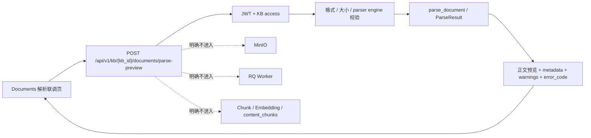

# CodeMap: 文档摄入联调界面（feature）

## 1. 范围

- **goal**: 将 parser 从尚未评审的分块/Embedding/入库链路中隔离出来，提供可视化的文档解析预览联调入口。
- **active_project**: `llm_wiki3.0`
- **active_workdir**: `D:\AI\知识库设计\llm_wiki3.0`
- **change_scope**: `local`
- **code scope**: `frontend/**`、`backend/app/parsers/api/**`、`backend/app/parsers/service/**`、`backend/app/config/settings.py`；并修正 parser 重构后的失效 import。

## 2. 入口与现有结构

| 区域 | 入口 | 当前职责 |
|---|---|---|
| 前端路由 | `frontend/src/App.tsx` | 当前仅注册 `/search`，根路径跳转搜索页 |
| 前端 API | `frontend/src/api.ts` | 登录、知识库列表、RAG 搜索 |
| 解析预览 API | `backend/app/parsers/api/document.py` → `parse_preview_endpoint`（计划新增） | 接收 multipart 文档并返回 parser 结果预览，不持久化 |
| 文档上传 API | `backend/app/parsers/api/document.py` → `upload_document_endpoint` | 接收 `file` 与 `parser_engine`，保存后异步入队 |
| 文档状态 API | `backend/app/parsers/api/document.py` → `get_status_endpoint` | 返回 `pending / processing / processed / failed` 与解析诊断信息 |
| 上传业务 | `backend/app/parsers/service/document.py` → `upload_document` | 校验格式/大小/引擎，写 MinIO、创建 Document、提交 RQ 任务 |
| Worker | `backend/app/workers/parse_document.py` → `parse_document_task` | 解析、图片持久化、分块、Embedding、写 `content_chunks`、更新状态 |
| 搜索验证 | `frontend/src/pages/Search.tsx` + `backend/app/search/**` | 对入库 chunk 发起 RAG 检索 |

## 3. 本轮联调链路



## 4. 解析预览返回语义

| 字段 | 语义 |
|---|---|
| `success` | parser 是否成功返回非空内容 |
| `content_preview` | 最多 `PARSER_PREVIEW_MAX_CHARS` 字符的正文预览 |
| `content_length` / `truncated` | 完整正文长度，以及预览是否被截断 |
| `metadata` / `warnings` | parser 原始诊断信息与非致命警告 |
| `error_code` / `error_message` | parser 稳定错误码与可读错误信息 |

## 5. 已发现阻断

- parser 目录重构后，应用与测试仍有多处引用不存在的 `app.parsers.errors`、`app.parsers.schemas`。
- 运行 `python -m pytest tests/test_parse_document_worker.py tests/test_parser_hardening_service.py -q` 在收集阶段报 `ModuleNotFoundError`。
- Docker Desktop 当前未运行，无法执行依赖 PostgreSQL、Redis、MinIO、Worker、Embedding API 的端到端验证。
- `frontend/node_modules` 当前不存在，前端尚未进行本机依赖安装与构建验证。

## 6. 前端目标切片

```text
frontend/src/
├── App.tsx                    # 注册 /documents，提供搜索/文档导航
├── api.ts                     # 文档上传、状态查询及知识库创建契约
├── pages/
│   ├── Search.tsx             # 保留现有搜索能力
│   └── Documents.tsx          # 文档上传与状态联调工作台
└── index.css                  # 全局视觉、响应式与交互状态
```

## 7. 边界与风险

- 解析预览不保存原文件、不创建 Document、不进入 RQ；它是 parser 联调入口，不冒充正式摄入成功。
- 本轮不测试也不修改分块、Embedding、`content_chunks` 或搜索链路。
- 本轮不新增文档列表、删除、重试、批量上传或 chunk 查询接口。
- Docker 联调需要 PostgreSQL（登录与 KB 权限）；Redis、MinIO 与 Embedding 不参与解析预览请求。
