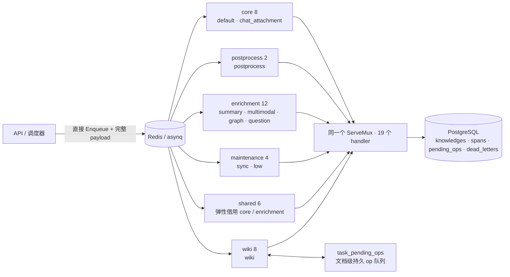

# WeKnora 与 llm-wiki-agent 任务队列设计对比

> 整理日期：2026-08-04
>
> 对比对象：
> - **WeKnora**（本仓库）：Go 语言，任务队列基于 `asynq`（Redis 任务队列库）
> - **llm-wiki-agent**（自有知识库项目）：Python，任务队列基于 `Taskiq` + Redis Stream + Transactional Outbox，自建三表任务运行时
>
> 参考文档：
> - `D:/AI/llm-wiki-agent/mydocs/任务运行时三表设计与消息队列原理详解.md`
> - `D:/AI/llm-wiki-agent/mydocs/taskiq-outbox-mechanism.md`

---

## 1. 一句话结论

WeKnora 的任务队列是「**成熟队列内核（asynq + Redis）+ 业务状态机 + 死信归档 + 一个只给 wiki 用的持久 ops 表**」，没有自建 Outbox / Publisher / Reaper 这一整套投递设施；llm-wiki-agent 则是在 Taskiq + Redis Stream 之上，自己把「可靠投递」完整做了一遍（Outbox、轮询 Publisher、fencing、Reaper）。

两者最终解决的是同一批问题，只是「哪些自己做、哪些交给框架」的分工不同：

- WeKnora 把**投递层复杂度**交给了 asynq（持久化、重试、延迟、死信、lease、去重全部内置）；
- llm-wiki-agent 把**投递层复杂度**自己做掉，换来了不依赖任何专业 MQ、完全掌控语义的运行时。

---

## 2. WeKnora 任务队列设计

### 2.1 总体架构

业务代码直接 `Enqueue` 任务到 Redis，由 6 个独立 `asynq.Server`（worker pool）消费 10 条物理队列；所有 handler 注册在同一个 `ServeMux` 上，靠 asynq 的原子出队保证同一个任务只被一个 worker 执行。



### 2.2 队列与 Worker Pool 拓扑

| Pool | 默认并发/实例 | 队列 | 用途 |
|---|:---:|---|---|
| Core | 8 | `default`、`chat_attachment` | 文档解析与手工重解析的保底容量 |
| Post-process | 2 | `postprocess` | 解析收尾与富化 fan-out 编排 |
| Enrichment | 12 | `summary`、`multimodal`、`graph`、`question` | 模型密集的富化保底 |
| Maintenance | 4 | `sync`、`low` | 数据源同步、批处理、删除/移动/清理 |
| Shared | 6 | Core 与 Enrichment 队列 | 弹性容量，按积压借用 |
| Wiki | 8 | `wiki` | 独立治理的 Wiki 生成 |

要点：

- Post-process 有独立物理队列，轻量 fan-out 不会被长 DocReader 调用堵住；
- Maintenance 不进 Shared 池，避免长任务占用用户侧管线需要的弹性容量；
- Shared 与专用 Server 可同时订阅 core/enrichment 队列，asynq 出队原子性保证每个任务仍只执行一次；
- 队列拓扑由 `types.QueueDefinitions` 单一事实来源声明，运行时面板展示的权重与实际 server 配置不会漂移。

### 2.3 需要入队的操作（19 种任务类型）

| 类别 | 任务类型（队列 / 池） | 典型重试 / 超时 |
|---|---|---|
| 文档解析主链路 | `document:process`（default/core）、`manual:process`（default/core）、`temporary_document:process`（chat_attachment/core） | MaxRetry 3，超时按配置（10min ~ 2h） |
| 后处理编排 | `knowledge:post_process`（postprocess） | MaxRetry 3，30min |
| 富化 fan-out | `summary:generation`、`datatable:summary`（summary）；`question:generation`（question，按 chunk 分批）；`chunk:extract`（graph，每 chunk 一个）；`image:multimodal`（multimodal，每图一个） | MaxRetry 3，30min |
| 维护 / 批处理 | `faq:import`、`kb:clone`、`knowledge:move`、`knowledge:list_delete`、`knowledge:list_reparse`、`index:delete`、`kb:delete`、`datasource:sync`（sync / low） | MaxRetry 3 ~ 10，1 ~ 2h |
| Wiki 管线 | `wiki:ingest`（wiki）、`wiki:finalize`（wiki） | MaxRetry 10，30 ~ 60min |

### 2.4 文档解析主链路示例

1. 上传文档 → 创建 `knowledges` 行（`parse_status=pending`）→ 直接入队 `document:process`，payload 携带全量信息（tenant、knowledge_id、文件路径、多模态开关、语言等）。
2. 解析任务内完成 DocReader → chunk → embedding，可并行派发多个 `image:multimodal`。
3. 解析完成后入队 `knowledge:post_process`——它是编排者：
   - 把 knowledge 从 `processing` 推进到 `finalizing`；
   - 预写 `pending_subtasks_count`（summary 1 + question 批次数 + graph 每 chunk + wiki 1）；
   - fan-out 所有富化子任务。
4. 每个子任务终态时原子递减计数（`FinalizeSubtask`），计数归零才把 `parse_status` 置为 `completed`。

这等价于 llm-wiki-agent 里 `document_process` 派生 `rag_index` 子 Run 的编排，只是用「计数」而不是 `parent_run_id` 表达依赖完成。

### 2.5 可靠性机制

| 机制 | WeKnora 的做法 |
|---|---|
| 重试 / 延迟 | asynq 内置 `MaxRetry`、`ProcessIn`、`RetryDelayFunc`；wiki 锁冲突固定 15s 重试，其余默认指数退避 |
| 幂等 / 去重 | asynq `TaskID` 全局去重（如 `wiki-finalize-<kb>`）+ 状态 CAS（`SetFinalizing`）+ pending ops 的 `dedup_key` |
| 死信 | `task_dead_letters` 表，asynq 中间件统一写（重试耗尽时），并回调把 knowledge 标为 failed |
| 持久 ops 队列 | `task_pending_ops`（PostgreSQL）：wiki 文档级 op（ingest / retract）落库，Redis 只放 KB 级 debounce 触发器；`ClaimBatch` 用 `FOR UPDATE SKIP LOCKED` 按 dedup_key 锁锚点行并发领取 |
| 崩溃恢复 | 启动时 `recover_pending_wiki_tasks` 按持久 op 重建 wiki 触发器；Lite 模式 `reset_pending_tasks` 重置孤儿任务；分布式模式交给 housekeeping |
| 双写处理 | **没有 Outbox**：先提交 DB 再直接入队；入队失败把业务行标为 failed 并返回给用户；进程在提交后、入队前崩溃的窗口靠启动恢复/清扫兜底 |
| Lite 模式 | 无 Redis 时用 `SyncTaskExecutor` 在 goroutine 中同步执行同一个 handler（支持 ProcessIn / MaxRetry 语义） |
| 可观测 / 管控 | `knowledge_processing_spans`（root / stage / subspan / generation + attempt + 级联取消）+ 运行时队列面板（cancel / run_now / delete、队列深度、retry、archived 统计） |

---

## 3. llm-wiki-agent 任务队列设计回顾

### 3.1 三表分工

| 表 | 角色 | 一行代表什么 |
|---|---|---|
| `processing_runs` | 任务运行账本（终态真相源） | 一次可独立调度、可审计的业务处理 |
| `processing_spans` | 阶段观测层（诊断流水） | Run 内一个可观测阶段或单次 Worker 执行尝试 |
| `task_outbox` | 可靠投递层（消息意图） | 一条待发布到 Redis Stream 的消息意图 |

### 3.2 完整流程

```text
用户/API 请求
    │
    ▼
DB 事务（原子写入）：INSERT processing_runs + INSERT task_outbox
    │
    ▼
Outbox Publisher（独立进程，每 0.5s 轮询，SKIP LOCKED 领取）
    │ 成功 → mark_outbox_published；失败 → release_outbox_claim + 退避
    ▼
Redis Stream（critical / default / multimodal / low）
    │
    ▼
Task Worker：claim_run（原子 CAS 去重）→ start_worker_attempt（Span）
    → 执行 Handler → 心跳续租（15s）
    → 成功 complete_run / 瞬时失败 retry_run / 终态失败 fail_run
    │
    ▼
Reaper（每 30s）：找卡住的 Run 且无未发布 Outbox → 补一条 Outbox
```

### 3.3 可靠性机制

- **双写原子性**：Run 与 Outbox 同事务写入，解决「DB 提交」和「Redis 投递」无法原子化的问题；
- **至少一次投递**：Redis Stream 天然 at-least-once，`claim_run` 原子 CAS 做消费者侧幂等；
- **Fencing**：`execution_token + execution_epoch + lease_expires_at` 三件套，挡住僵尸/过期 Worker 的写入；
- **两层重试**：自动重试（同一条 Run 回退 pending，`processing_spans` 记录 attempt）与业务重跑（新建 Run，`retry_of_run_id` 形成链）；
- **错误分类**：`TransientTaskError`（退避重投）vs `TerminalTaskError`（终态不再重试）；
- **Reaper 兜底**：pending 太久 / running 租约过期且无未发布 Outbox 时补投递。

---

## 4. 异同对比

### 4.1 相同点

1. **都按业务语义分多条队列**：llm-wiki-agent 的 4 条 Stream（critical/default/multimodal/low）与 WeKnora 的 10 条队列，目的都是优先级与背压隔离。
2. **都有「任务账本 + 阶段流水」**：`processing_runs` ↔ `knowledges.parse_status` 等业务状态；`processing_spans` ↔ `knowledge_processing_spans`，且都有 attempt、parent、status、error_code/message、duration、级联取消。这是这类系统的公共必需件。
3. **都有死信/终态错误归档**：llm-wiki-agent 错误落在 Run/Span 终态；WeKnora 有独立 `task_dead_letters` 表。
4. **都有延迟投递/去抖**：llm-wiki-agent 的 `available_at` ↔ WeKnora 的 `ProcessIn`（wiki 30s debounce、finalize 20s 合并）。
5. **都有类 SKIP LOCKED 的并发领取**：`claim_outbox_batch` ↔ `ClaimBatch`（按 dedup_key 锁锚点行）。
6. **都有兜底恢复**：Reaper ↔ `recover_pending_wiki_tasks` / `reset_pending_tasks` / housekeeping。
7. **都有幂等去重手段**：`claim_run` CAS ↔ `TaskID` 去重 / `SetFinalizing` 状态 CAS / pending ops `dedup_key`。
8. **都有运行时可观测与操作**：span 流水 ↔ 运行时队列面板（含 cancel / run_now / delete）。

### 4.2 差异点

| 维度 | llm-wiki-agent（Taskiq + Outbox） | WeKnora（asynq） |
|---|---|---|
| 队列内核 | Redis Stream + Taskiq，投递可靠性自己造 | asynq，持久化 / 重试 / 延迟 / 死信 / lease 全内置 |
| 双写原子性 | Transaction Outbox，Run 与 Outbox 同事务 | 直接入队；失败把业务行标 failed；崩溃窗口靠恢复扫描兜底 |
| 消息内容 | 只传 `run_id`，worker 回 DB 读快照 | 传完整 payload（ID、路径、配置快照、attempt） |
| 任务账本 | `processing_runs` 统一账本，一行一操作 | 无独立 run 表，`knowledges.parse_status` + `pending_subtasks_count` 即账本 |
| 执行租约 | 自写 token + epoch + lease + 15s 心跳续租 | asynq 内部 lease（Timeout 驱动），无自建 epoch |
| 幂等去重 | `claim_run` 原子 CAS + 预留 `idempotency_key` | `TaskID` 全局去重 + 状态 CAS + `dedup_key` |
| 重试 | 两层自定义：Outbox 投递重试 + 业务瞬态/终态分类，退避自写 | asynq `MaxRetry` + 自定义 `RetryDelayFunc` + LLM 内部重试 + pending op `fail_count` |
| 死信 | 无独立表，错误落 Run/Span | `task_dead_letters` 表，中间件统一写 |
| 延迟/去抖 | `available_at` 手动实现 | `ProcessIn` + `TaskID` 合并 |
| 崩溃恢复 | Reaper 每 30s 扫 stuck run 补 Outbox | 启动重建 wiki 触发器 + Lite 模式重置孤儿 + housekeeping |
| 编排 | `parent_run_id` 派生子 Run，形成树 | postprocess 内 fan-out + 子任务计数（`pending_subtasks_count`） |
| 进程拓扑 | API / outbox-publisher / worker 三个容器 | 单进程内 6 个 asynq.Server（Lite 模式甚至零 Redis） |
| 可观测 | `processing_spans` 流水 | `knowledge_processing_spans` + 运行时队列面板 |

### 4.3 概念映射

| llm-wiki-agent | WeKnora | 说明 |
|---|---|---|
| `processing_runs` | `knowledges`（parse_status / summary_status / error_message） | 账本位置不同：统一表 vs 业务行 |
| `processing_spans.worker_attempt` | `knowledge_processing_spans`（root/stage/subspan/generation） | 几乎同构，WeKnora 的 span 树更细 |
| `task_outbox` | asynq Redis 队列 + `task_pending_ops` | 一般任务无 outbox；wiki 用 PG 持久 ops |
| Outbox Publisher + Reaper | asynq 内置 + 启动恢复 / housekeeping | 投递兜底职责相同，实现位置不同 |
| `claim_run`（token/epoch/lease） | `TaskID` 去重 + 状态 CAS + asynq lease | fencing 语义相同，载体不同 |
| `retry_run` / `fail_run` | asynq retry / `task_dead_letters` + 回调标 failed | 两层重试 vs 框架重试 |
| `parent_run_id` 编排树 | `pending_subtasks_count` 计数 | 依赖表达方式不同 |

---

## 5. Python + Redis 的成熟框架选项

### 5.1 概念澄清：asynq 不是 broker，也不适用于 Python

- **Broker（消息中间件）**：负责存消息、投消息、确认送达的系统，如 RabbitMQ / Kafka / Redis。
- **任务框架（Task framework）**：跑在 broker 之上，提供 worker 进程、序列化、重试、延迟、死信等能力，如 Celery / Dramatiq / Taskiq。
- asynq 是 **Go 版的「框架 + Redis 适配器」二合一**，不是 Python 可用的 broker。它在 Python 侧的对应物是 Dramatiq / Celery / arq，而不是 RabbitMQ。

llm-wiki-agent 当前是 **Taskiq（薄框架）+ Redis Stream（裸 broker）**。Taskiq 给得不全，所以自建了 Outbox / Publisher / Reaper / fencing——其中 Outbox 补的是「双写原子性」，重试、延迟、死信是另一组框架能力，同样需要自补。

### 5.2 框架对比

| 框架 | Redis broker | 重试 | 延迟 | ack / 崩溃重投 | 死信 | 评价 |
|---|---|---|---|---|---|---|
| **Dramatiq** | ✅ | ✅ 指数退避、上限 | ✅ delay/ETA | ✅ visibility timeout，worker 崩溃自动 requeue | ✅ **内置 Dead Letter Mailbox** | 最接近 asynq，最推荐 |
| **Celery** | ✅ | ✅ autoretry_for / max_retries / backoff | ✅ countdown/ETA | ✅ acks_late + visibility_timeout + reject_on_worker_lost | ⚠️ Redis 下无原生死信（RabbitMQ 才有 DLX） | 最成熟，但重、配置多 |
| arq | ✅ | ✅ max_tries / retry_delay | ✅ defer_by / defer_until | ❌ worker 崩溃时正在执行的任务会丢 | ❌ | 轻量，个人项目够用，但能力不全 |
| RQ | ✅ | ✅ 有限（max retries） | ✅ enqueue_in | ❌ 无 ack 语义，崩溃后任务停在 started | ❌ | 最简单，可靠性最弱 |
| Taskiq + RedisStream | ✅ | 部分 | 部分 | ❌ | ❌ | llm-wiki-agent 现状 |

### 5.3 推荐与注意事项

- **最推荐 Dramatiq + Redis**：内置重试（退避 + 上限）、延迟、ack + 可见性超时、死信邮箱、结果后端、定时任务、限流，可直接删掉 `task_outbox` + Publisher + Reaper + 投递级退避。
- **Celery + Redis 备选**：能力最全、生态最大，但 Redis 下无原生死信，且 acks_late / visibility_timeout 等配置要自己搞对；有 RabbitMQ 时更合适。
- **Redis 系框架都没有 asynq 那种 token + epoch + lease 的 fencing**：它们提供「至少一次投递 + 可见性超时重投」，重复执行要靠业务幂等兜住。`claim_run` CAS 思路（或简化版：状态机原子领取）换到任何框架都要保留，或接受重复执行无害的业务设计。

---

## 6. WeKnora 的双写一致性分析

结论：**WeKnora 没有实现 Outbox，普通任务不保证双写一致**。它明确接受双写窗口，用「失败可见 + 恢复扫描」兜底；只有 Wiki 管线做了一个「迷你 Outbox」（意图同事务落库 + 触发器可重建）。

### 6.1 一般任务：先提交 DB，再直接入队

以上传文档为例（`internal/application/service/knowledge_create.go`）：

1. 先创建 `knowledges` 行（DB 提交）；
2. 再 `Enqueue` 到 asynq；
3. 入队失败 → `markKnowledgeEnqueueFailed` 把知识行标为 failed，API 照常返回（文件已保存，但状态失败），用户可见、可手动重试；
4. 提交成功但进程在入队前崩溃 → 任务确实丢失，靠恢复扫描兜底：
   - Lite 模式：启动时 `reset_pending_tasks` 把卡住的孤儿行重置为 failed；
   - 分布式模式：交给 housekeeping（同时检查 span 活动与真实 asynq 队列，避免误重置仍在运行的副本）。

### 6.2 Wiki 管线：迷你 Outbox

wiki 的文档级操作不直接进 Redis，而是写 `task_pending_ops` 表，并且与业务状态变更放在同一个 DB 事务里：

- `SeedKnowledgeFinalizingWithPendingOp`：knowledge 推进到 `finalizing` + 写入 wiki pending op，同一事务；
- `EnqueueIfKnowledgeBaseActive`：对 KB 加 SHARE 锁，防止已删除 KB 再写入持久操作。

Redis 里只放一个 KB 级 debounce 触发器（30 秒）。触发器丢失没关系：启动时 `recover_pending_wiki_tasks` 会从 `task_pending_ops` 按 KB 重建触发器。

这就是 Transactional Outbox 的简化版：**把「意图」事务化落库，把「触发」做成可重建的**。差别在于没有轮询 Publisher，而是「落库 + 尽力投递 + 启动补投」。

### 6.3 总结

| 链路 | DB 侧一致性 | Redis 投递侧 |
|---|---|---|
| 普通任务（document:process、summary 等） | 无 Outbox | 无保证，靠失败可见 + 恢复扫描 |
| Wiki 任务 | 有保证（pending op 与业务状态同事务） | 尽力而为 + 启动重建触发器 |

---

## 7. 结论与启发

1. **复杂度来源是「自建 MQ 行为」，不是三表本身**。llm-wiki-agent 里真正在重新发明 MQ 的只有 Outbox Publisher、SKIP LOCKED、投递级 lock_token、多 Stream 手动路由；换 RabbitMQ / Kafka / asynq 后可删大半。
2. **无论哪种队列都省不掉的部分**：任务账本/业务状态机、阶段流水（spans）、死信归档、并发领取的去重、启动恢复、多队列隔离、错误分类。WeKnora 的代码验证了这一点。
3. **两种双写策略各有权衡**：
   - Outbox：多一个 publisher 进程和表，换来「业务提交成功 = 投递意图一定落库」，不依赖投递时机；
   - 直接入队：简单，但提交后入队前崩溃的窗口可能静默丢任务，需要恢复扫描兜底，入队失败时业务行只能标 failed。
4. **可简化路径**（Python 项目推荐 Dramatiq + Redis，或 Celery + RabbitMQ）：保留 `processing_runs` + `processing_spans` + 业务幂等 CAS，删除 `task_outbox` + publisher + reaper + 投递级 fencing；或将 Outbox 只保留给「必须不丢」的关键链路（如入库），普通任务直接投递 + 失败标 failed + 恢复扫描。
5. **值得从 WeKnora 借鉴的点**：`pending_subtasks_count` 计数式 fan-out 完成判定、`TaskID` 做去抖合并（debounce + 合并为一条任务）、独立的死信表（可按 scope/task_type 查询）、单进程多 Server 的拓扑简化。

---

## 8. 附录：关键文件索引

### WeKnora（本仓库）

| 文件 | 职责 |
|---|---|
| `internal/types/task.go` | 队列/池拓扑、19 种任务类型与 payload 定义 |
| `internal/router/task.go` | asynq Server 构造、ServeMux 注册、中间件、handler 注册表 |
| `internal/router/sync_task.go` | Lite 模式同步执行器 |
| `internal/application/service/knowledge_task_options.go` | document / postprocess 任务入队选项 |
| `internal/application/service/knowledge_post_process.go` | 后处理编排：finalizing + fan-out + 计数 |
| `internal/application/repository/task_queue.go` | `task_pending_ops` 持久队列与并发领取 |
| `internal/types/task_pending_op.go` / `internal/types/task_dead_letter.go` | 持久 ops 与死信表模型 |
| `internal/middleware/asynqdl/asynqdl.go` | asynq 死信中间件 + 业务状态回调 |
| `internal/types/knowledge_span.go` / `internal/application/service/knowledge_span_tracker.go` | 阶段流水（span 树、attempt、级联取消） |
| `internal/container/recover_pending_wiki_tasks.go` / `internal/container/reset_pending_tasks.go` | 启动恢复 |
| `internal/router/task_inspector.go` | 运行时任务面板（cancel / run_now / delete、队列统计） |
| `migrations/versioned/000041_task_queue_and_wiki_indexes.up.sql` | `task_pending_ops` + `task_dead_letters` 建表 |
| `migrations/versioned/000056_knowledge_pending_subtasks.up.sql` | `pending_subtasks_count` 计数列 |
| `docs/worker-pool-governance.md` | Worker Pool 治理文档 |

### llm-wiki-agent（外部项目）

| 文件 | 职责 |
|---|---|
| `backend/app/models/task_runtime.py` | 三张表数据模型 |
| `backend/app/workers/core/runtime.py` | `create_run_with_outbox` / `claim_run` / `complete_run` / `fail_run` / `retry_run` / `renew_lease` / span 操作 |
| `backend/app/workers/core/executor.py` | `execute_run_message` / `_handle_failure` / `_heartbeat_loop` |
| `backend/app/workers/core/tasks.py` | `RUN_HANDLERS` 注册表 / `worker_identity` / `queue_name_for_run` |
| `backend/app/workers/core/broker.py` | 四条 Redis Stream 定义 |
| `backend/app/workers/outbox/outbox.py` / `outbox_service.py` / `outbox_worker.py` / `publisher.py` / `reaper.py` | Outbox Publisher 与 Reaper |
| `backend/app/knowledge_bases/service/rag_ingestion.py` | `document_process` / `rag_index` handler |
| `backend/app/parsers/service/document.py` | `create_run_with_outbox` 调用点 |
